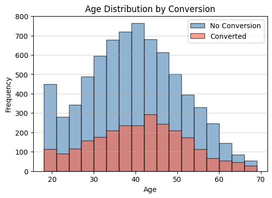
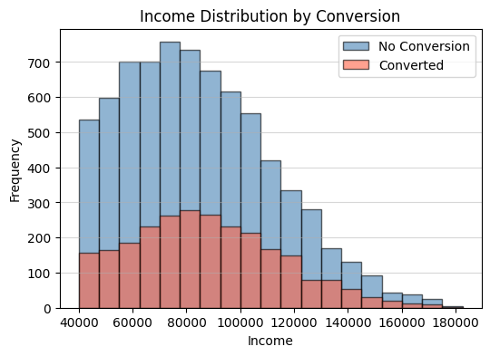
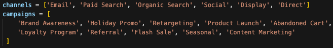
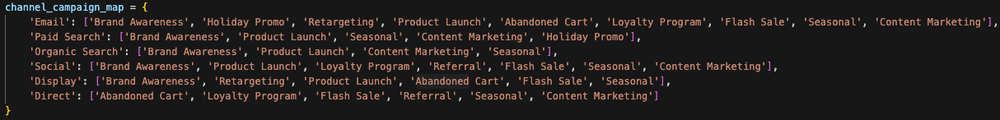
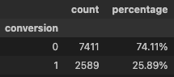
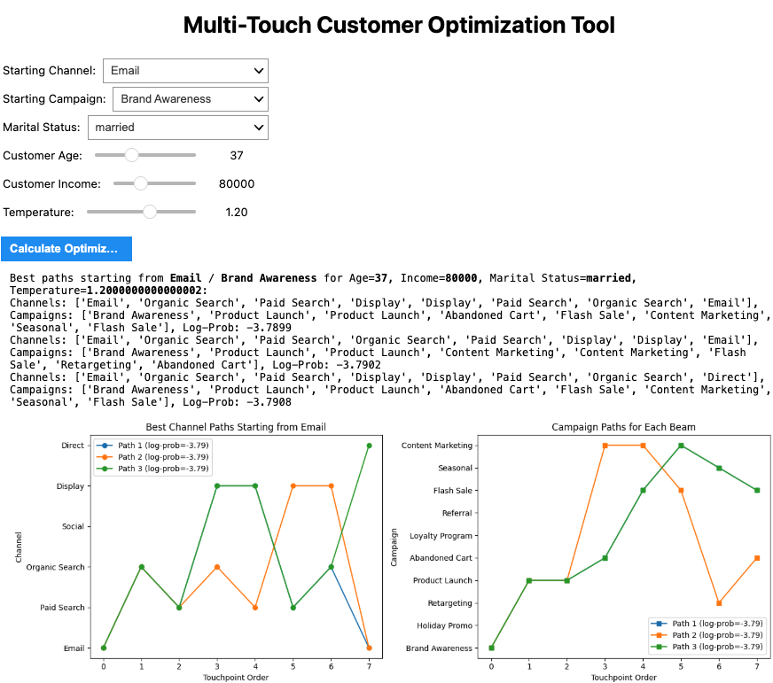

# Multi-Touch LSTM Beam Model

This project demonstrates a multi-touch marketing attribution model using an LSTM neural network and beam search for optimal channel and campaign path analysis. It generates synthetic customer and touchpoint data, trains an LSTM to predict conversion, and provides an interactive Jupyter notebook for scenario exploration.

## Features
- Synthetic data generation for customers and marketing touchpoints
- LSTM model for multi-touch attribution
- Beam search for optimal channel/campaign path discovery
- Interactive UI for exploring customer scenarios and path recommendations

## Synthetic Data

The synthetic customer data is generated using realistic distributions: Age is sampled from a normal distribution (clipped to 18-70), and Income is drawn from a truncated normal distribution centered around $75,000. Marital status is randomly assigned with realistic probabilities, and the conversion target is correlated with age, income, and marital status to reflect real-world marketing response patterns. Below are the distributions for Age and Income.

The following lists are used to generate the Touchpoints dataset:

Then, we define the permissible Campaigns per Channel to be used in data generation and the final beam search:

The touchpoint sequences are generated with a conversion bias to give the LSTM a learnable signal. Converting customers are routed through high-intent, bottom-funnel channels — Email (30%), Direct (25%), and Paid Search (20%) dominate their journeys — while non-converters are steered toward awareness-stage channels like Organic Search (30%), Social (25%), and Display (20%). Campaign selection follows the same logic: converters are 3–6x more likely to encounter retention and re-engagement campaigns such as Retargeting, Abandoned Cart, and Loyalty Program, whereas non-converters are weighted toward Brand Awareness and Content Marketing. Converters are also given longer touchpoint sequences (3–8 steps) to reflect a realistic multi-touch re-engagement pattern, compared to non-converters who typically have shorter journeys (1–6 steps).

The resulting customer counts and conversion rate is shown below:

## LSTM Model

The model is a multi-input Keras functional LSTM that accepts three inputs — a channel sequence (length 8), a campaign sequence (length 8), and 3 scaled customer features (age, income, marital status) — where the channel and campaign sequences are each passed through 4-dimensional embeddings before being concatenated and fed into a 128-unit LSTM. 

The LSTM output is then concatenated with the customer features and passed to a single sigmoid output neuron for binary conversion prediction, compiled with binary cross-entropy loss and tracked across accuracy, precision, and recall. 

Training uses:
 * the Adam optimizer
 * learning rate of 0.0001 with clipnorm=1.0 to suppress gradient spikes
 * a batch size of 128 for stable gradient estimates
 * 30 epochs on a 90/10 train/validation split
 
 Two callbacks govern convergence: EarlyStopping (patience=10, restoring best weights) halts training if validation loss stops improving, while ReduceLROnPlateau halves the learning rate whenever validation loss plateaus for 3 consecutive epochs down to a floor of 1e-6. To address the ~8% positive-class imbalance in the target, compute_class_weight('balanced') is used to upweight the minority class (non-converters) proportionally during training, preventing the model from collapsing into a majority-class predictor.

## Beam Search

Beam search is a decoding algorithm for sequence generation tasks (e.g., machine translation, text generation, speech recognition). Rather than choosing the single most likely token at each step, it keeps a fixed-size set of top candidate sequences (the beam) and expands them in parallel to find higher-probability outputs.

In this scenario, the beam search finds the highest-converting sequences of channels and campaigns for a given customer profile, starting from a fixed first touchpoint. It maintains a set of beam_width (set to 3) candidate paths simultaneously — each path being a growing list of channel indices and campaign indices — and expands them one touchpoint at a time up to max_touchpoints. At each step, every existing beam is extended by trying all possible next channels, and for each channel it scores all valid campaigns using the LSTM model's predicted conversion probability. Two hard constraints are enforced during expansion: no single channel or campaign can appear more than twice in a path, and duplicate channel sequences are suppressed via seen_channel_seqs. The temperature parameter controls exploration — values below 1.0 sharpen the probability distribution toward the top candidate, while values above 1.0 flatten it to allow more variety.

Campaign selection is intentionally stochastic rather than purely greedy: for each channel at each step, the top-campaign_sample_topk campaigns are identified by log-prob score, then one or more are sampled proportionally from that shortlist. This prevents the search from always collapsing to the same deterministic path and encourages diversity across beams.

## Usage
1. Open `channel_path_beam_search.ipynb` in Jupyter or VS Code.
2. Run all cells to generate data, train the model, and launch the interactive tool.
3. Use the dropdowns and sliders to explore different customer profiles and marketing strategies.

## Example UI

Users can select Starting Channel, Starting Campaign, as well as Customer Age, Income, Marital Status. The Model Temperature value controls a more deterministic search (<1) or more exploratory search (>1). The results will refresh with the recommended Channel path and Campaign path that optimize liklihood of Customer Conversion.

Let's say we have a customer that is 37, makes $80k, is married. We know the initial customer touchpoint is an email with a Brand Awareness campaign. We can raise the Temperature to 1.2 to encourage more exploration, then click the Calculate Optimization button: 

The beam search and results are restricted to the permissible static channel_campaign_map. However, in a real-world marketing context, this channel_campaign_map might be user-specific or vary based on seasonality.

---

**Requirements:** Python 3.8+, TensorFlow, scikit-learn, matplotlib, ipywidgets, scipy

Find me on LinkedIn -> [mateo-wheeler](https://www.linkedin.com/in/mateo-wheeler/)