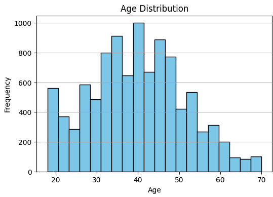
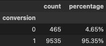

# Multi-Touch LSTM Beam Model

This project demonstrates a multi-touch marketing attribution model using an LSTM neural network and beam search for optimal channel and campaign path analysis. It generates synthetic customer and touchpoint data, trains an LSTM to predict conversion, and provides an interactive Jupyter notebook for scenario exploration.

## Model Features
- Synthetic data generation for customers and marketing touchpoints
- LSTM model for multi-touch attribution
- Beam search for optimal channel/campaign path discovery
- Interactive UI for exploring customer scenarios and path recommendations

## Synthetic Data

The synthetic customer data is generated using realistic distributions: Age is sampled from a normal distribution (clipped to 18-70), and Income is drawn from a truncated normal distribution centered around $75,000. Marital status is randomly assigned with realistic probabilities, and the conversion target is correlated with age, income, and marital status to reflect real-world marketing response patterns. Below are the distributions for Age and Income.

The following lists are used to generate the Touchpoints dataset:

The resulting customer counts and conversion rate is shown below:

## Usage
1. Open `channel_path_beam_search.ipynb` in Jupyter or VS Code.
2. Run all cells to generate data, train the model, and launch the interactive tool.
3. Use the dropdowns and sliders to explore different customer profiles and marketing strategies.

## Example UI

Users can select Starting Channel, Starting Campaign, as well as Customer Age, Income, Marital Status. The Model Temperature value controls a more deterministic search (<1) or more exploratory search (>1). The results will refresh with the recommended Channel path and Campaign path that optimize liklihood of Customer Conversion.

---

**Requirements:** Python 3.8+, TensorFlow, scikit-learn, matplotlib, ipywidgets, scipy

For questions or contributions, please open an issue or pull request.
